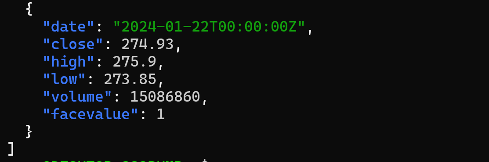
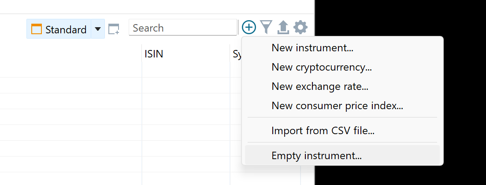
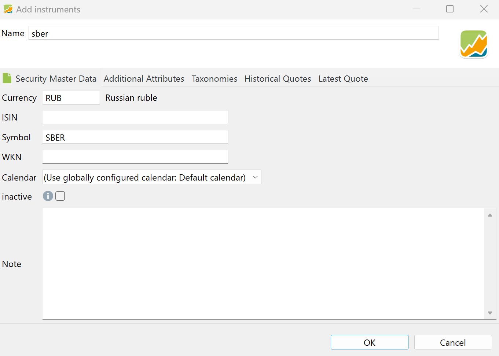
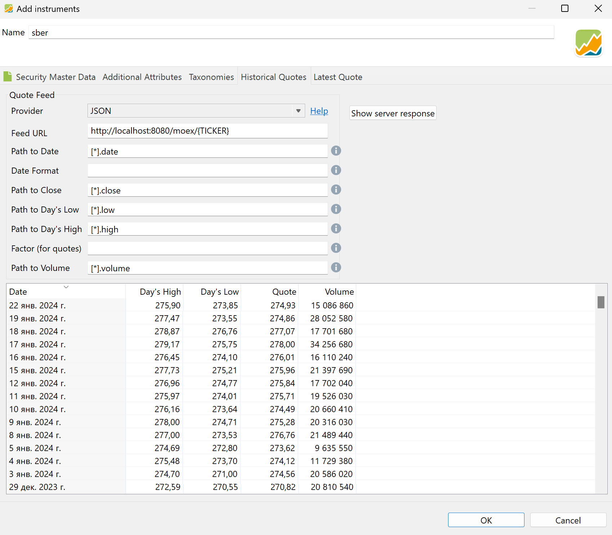
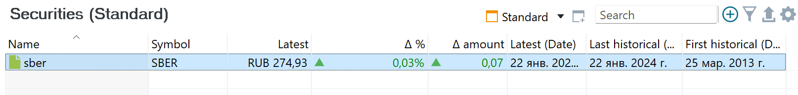

# go-exchange-api

Проект для получения данных с бирж MOEX и SPBEX для использования с [Portfolio-Performance](https://www.portfolio-performance.info/).

## Ограничения

Для биржи Moex требуется использовать Redis для кеширования истории цен. Также для нее данные запаздывают на один торговый день - условно, получаете данные _за вчера._

## Как развернуть

Проще всего использовать `docker`:

```bash
docker compose up -d
```

```yaml
version: '3'

services:
  redis-cache:
    image: redis:7-alpine
    volumes:
      - redis:/data

  exchange-api:
    image: kotasha/go-exchange-api:latest
    environment:
      EXCHANGE_API_REDIS: redis://redis-cache:6379/0
    ports:
      - 8080:8080/tcp

volumes:
  redis: 
```

## Как проверить

```bash
curl http://localhost/moex/sber | jq
```



Вместо биржи `moex` также можно использовать `spbex`.

## Как настроить Portfolio Performance

Во вклакде `All Securities` нажимаем знак `⊕`, а затем `Empty instrument`.



На вкладке `Security Master Data` заполняем название актива, бумагу и тикер.



На вкладке `Historical Quotes` выбираем `Provider: JSON` и заполняем поля:

```params
Feed URL:           http://localhost:8080/moex/{TICKER}
Path to Date:       [*].date
Path to Close:      [*].close
Path to Day's Low:  [*].low
Path to Day's High: [*].high
Path to Volume:     [*].volume
```



Результат:


