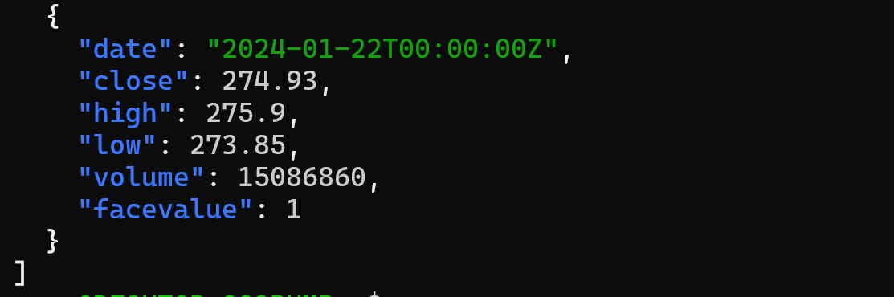
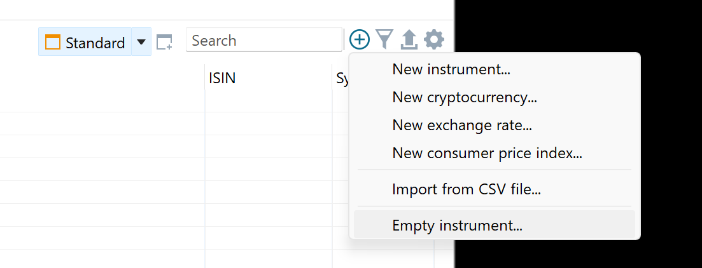
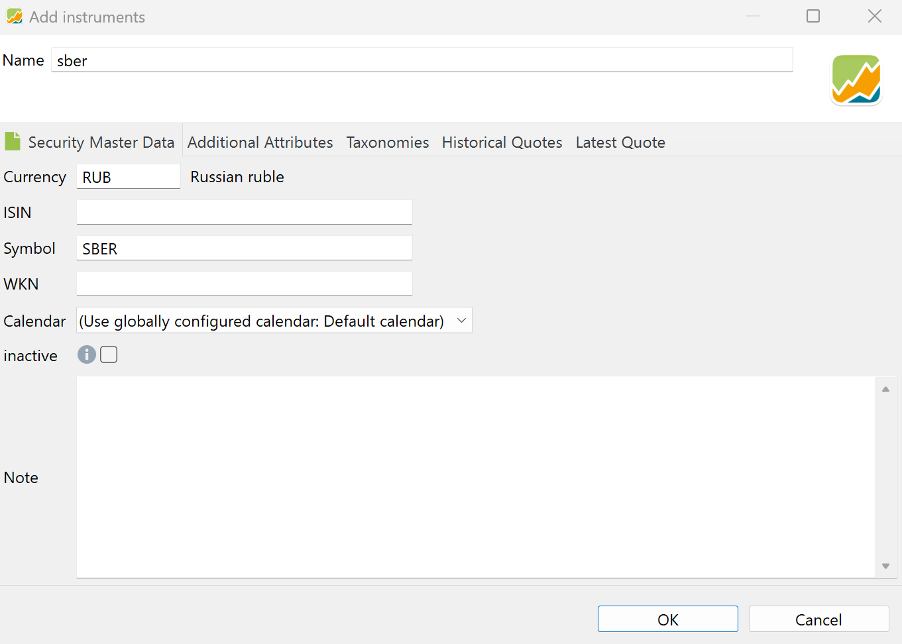
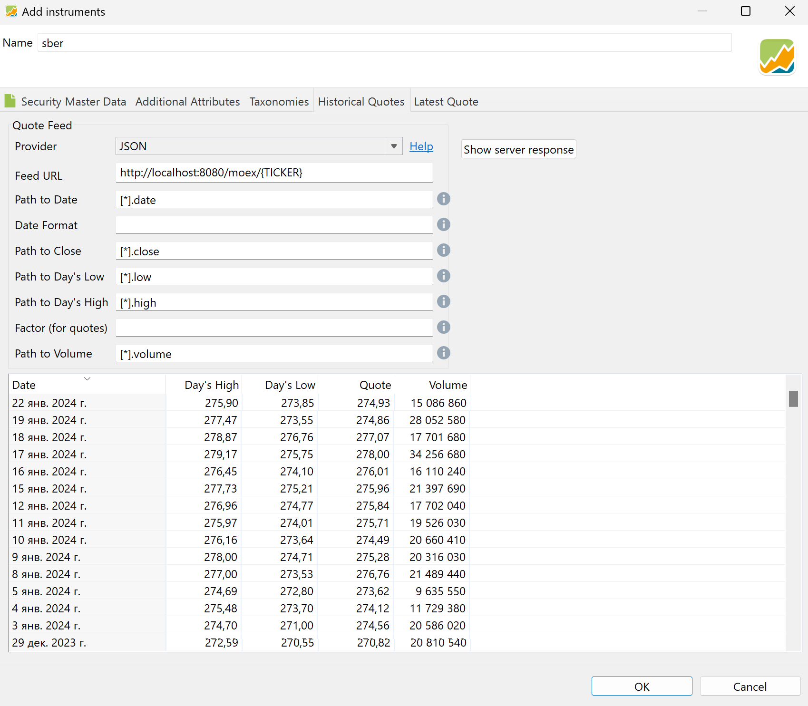
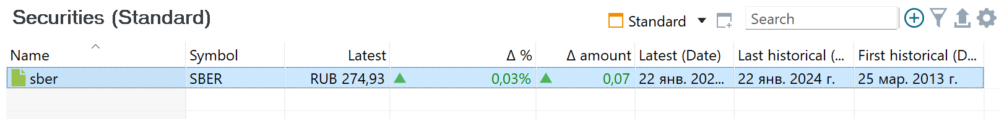

# go-exchange-api

Проект для получения данных с бирж MOEX и SPBEX для использования с [Portfolio-Performance](https://www.portfolio-performance.info/).

## Видео об этом

[](https://www.youtube.com/watch?v=L4K1NdUF1Ic)

## Ограничения

Для биржи Moex требуется использовать Redis для кеширования истории цен. Также для нее данные запаздывают на 20 минут относительно торгов.

## Как развернуть

Проще всего использовать `docker`:

```bash
docker compose up -d
```

```yaml
version: '3'

services:
  redis-cache:
    image: redis:7-alpine
    volumes:
      - redis:/data
    healthcheck:
      test: [ "CMD-SHELL", "redis-cli ping | grep PONG" ]
      interval: 30s
      timeout: 10s
      retries: 3
      start_period: 30s

  exchange-api:
    image: ghcr.io/kiberdruzhinnik/go-exchange-api:latest
    environment:
      EXCHANGE_API_REDIS: redis://redis-cache:6379/0
    ports:
      - 8080:8080/tcp
    depends_on:
      - redis-cache
    healthcheck:
      test: [ "CMD-SHELL", "./healthcheck" ]
      interval: 30s
      timeout: 10s
      retries: 3
      start_period: 30s

volumes:
  redis:
```

## Как проверить

```bash
curl http://localhost:8080/moex/sber | jq
```



Вместо биржи `moex` также можно использовать `spbex`, например `/spbex/SPBE`.

Данные СПБ Биржи загружаются напрямую из публичного источника [графиков котировок](https://spbexchange.ru/market-data/charts/): `/api/reader/marketdata/charts/chistory` с дневным интервалом `resolution=1440`. Возвращается вся доступная источнику история, включая последнюю доступную дневную свечу; её `close` — последняя доступная цена. Дата соответствует данным источника, поэтому при отсутствии торгов последняя запись может относиться к предыдущей сессии. В Go последнюю запись можно отдельно получить методом `SpbexAPI.GetCurrentPrice`.

Источник не передаёт объём торгов и номинал: `volume` равен `0`, `facevalue` равен `1`. Графики иностранных ценных бумаг используют показатель «Текущая цена рынка», который может включать цены первоначальной иностранной биржи листинга. Это публичный источник сайта, без гарантии доступности или задержки котировок.

## Как настроить Portfolio Performance

Во вклакде `All Securities` нажимаем знак `⊕`, а затем `Empty instrument`.



На вкладке `Security Master Data` заполняем название актива, бумагу и тикер.



На вкладке `Historical Quotes` выбираем `Provider: JSON` и заполняем поля:

```params
Feed URL:           http://localhost:8080/moex/{TICKER}
Path to Date:       [*].date
Path to Close:      [*].close
Path to Day's Low:  [*].low
Path to Day's High: [*].high
Path to Volume:     [*].volume
```



Результат:


